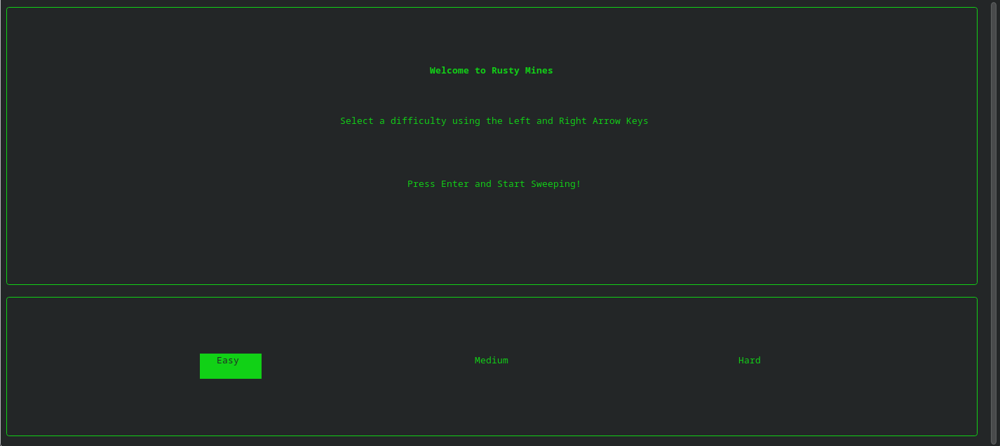

# RustyMines 
A fun project for learning Rust that can be completed in a short time. 

Currently, the project has a backend working mienfield that passes all tests and a start menu that is purely aesthetic. Below is the start menu.

